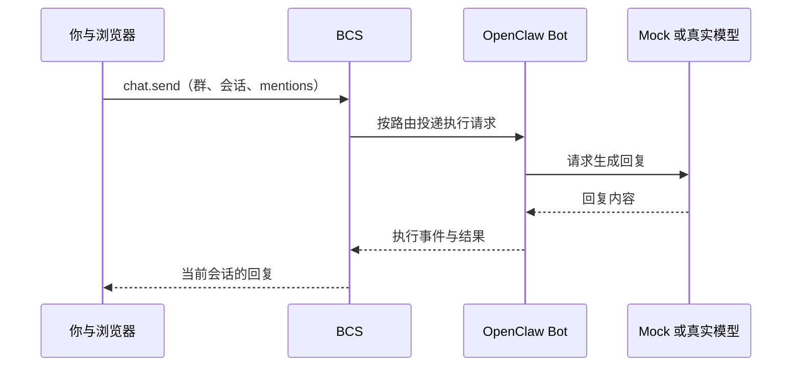
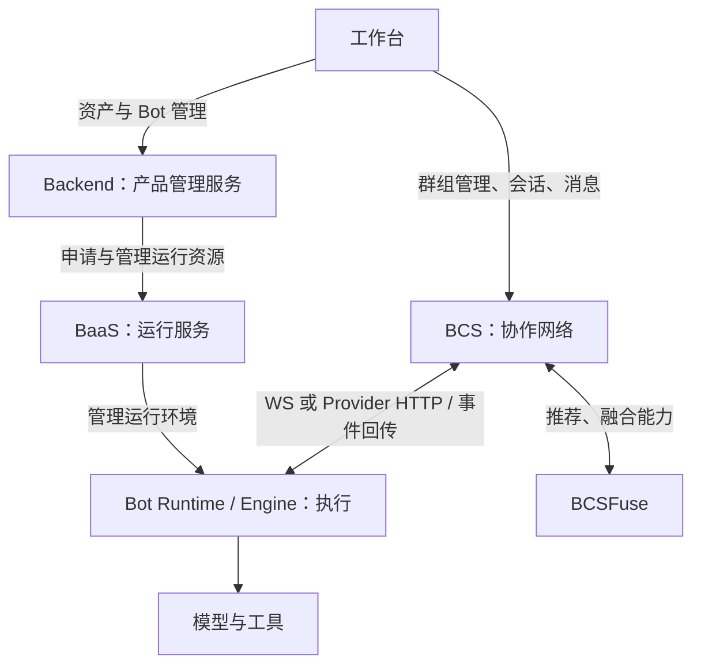

# Avernet 学习手册：先运行、再实操、最后读源码

调研基线：Avernet 仓库，提交 b17ccd42，2026-09-09。操作入口、模型模式和代码位置已与当前仓库核对；本手册尚未经过整套服务的实际启动验收，不将下面的预期现象表述为已验证结果。

这份手册按第一次接触产品的顺序展开。前两阶段先操作页面，不要求理解 Rust、依赖注入或插件架构。完成一轮产品体验后，再通过浏览器请求与服务日志看见链路，最后打开对应源码解释观察结果。

| 顺序 | 你要做什么 | 留下什么成果 |
| --- | --- | --- |
| [第一阶段：运行](#run) | 在本机启动，确认服务、页面和 Bot 都可用 | 一份启动检查记录 |
| [第二阶段：体验与实验](#practice) | 创建群、发送消息、定向提及、新建会话；可选真实模型协作 | 一个你亲手使用过的协作群 |
| [第三阶段：观察链路](#observe) | 重放一次发送，查看 HTTP、WebSocket 和日志 | 一张有实际 ID 的消息旅程图 |
| [第四阶段：读源码](#source) | 用源码回答实验中的问题 | 一条从页面到返回结果的调用链 |
| [第五阶段：扩展全局](#architecture) | 理解其余服务及业务边界 | 项目的模块地图 |
| [第六阶段：验证理解](#verify) | 读测试、预测结果、完成一个小改动 | 一次能够解释和验证的改动 |

<a id="run"></a>

## 第一阶段：先把当前产品运行起来

### 1.1 这一次要看到什么

当前默认启动入口是仓库根目录的 `scripts/singlebox.sh`。它启动 BaaS、Backend、BCSFuse、BCS、五个本地 OpenClaw Bot、一个 Backend 创建的 developer Bot，以及 `src/frontend` 工作台。

这次体验的主要页面是：首页、Bot 入网和协作群聊天。仓库还包含下一代前端、Skill 管理等更多能力，但默认页面不会一次展示所有模块；先用已经接入的五个 Bot 完成下面的实验。

第一轮使用 **Mock Model**：本地模型服务返回固定格式的问候，便于先确认消息往返，不需要真实模型账号。依赖安装、源码构建仍需要网络。它不能验证角色推理、复杂工具调用、智能推荐或融合质量。

### 1.2 选择终端并进入仓库

仓库原生启动文档面向 macOS/Linux。Windows 用户建议在 WSL2 Ubuntu 中沿本手册操作；这是根据脚本平台要求给出的环境建议，本次未验证 WSL 兼容性。

在 Windows PowerShell 中检查：

```powershell
wsl --status
wsl -l -v
```

确认已有可用的 WSL2 Linux 发行版后，进入其终端。若尚未安装，先准备 WSL2/Linux 环境，再继续。Linux/macOS 用户直接使用自己的终端。

进入实际的 Avernet 仓库根目录，确认以下两个文件存在：

```bash
pwd
ls README.md scripts/singlebox.sh
```

Windows 磁盘在 WSL 中通常挂在 `/mnt/<盘符>/`。后续所有命令，除特别标注外，都在 **Linux/WSL 的仓库根目录** 执行；不要把 Bash 的 `export` 或环境变量前缀语法直接粘贴到 PowerShell。

如果你已经使用 Docker，可以走 [Docker 指南](docker.zh-CN.md)。该指南有自己的构建、端口和日志入口；完成启动后回到第二阶段。下面的 Mock 启动步骤针对原生 singlebox，不直接套用于 Docker。

### 1.3 预检并准备依赖

先执行：

```bash
bash scripts/singlebox.sh check
```

当前命令根据默认启动组选择预检项。第一次运行时，工具缺失、虚拟环境或构建产物尚未生成可能导致检查失败；先根据输出区分需要安装的工具和随后 setup 才会生成的内容。

工具准备可参考 [依赖说明](dependencies.zh-CN.md)。关键依赖包括：

| 工具 | 在这里做什么 |
| --- | --- |
| Python / uv | 安装和运行 Python 服务；Backend 使用 Python 3.12 |
| Node.js 22+ / npm | 构建前端与 BCN 插件 |
| Rust 1.91+ / Cargo / protoc | 构建 BCS 与 CLI |
| OpenClaw / jq | 启动 Bot、生成与读取配置 |
| 系统编译工具及相关开发库 | 编译 Rust/Python 的原生依赖 |

需要脚本辅助安装时执行：

```bash
bash scripts/singlebox.sh install-tools
```

此向导会安装缺失工具，可能调用包管理器并写入用户目录，按它的提示操作。工具安装完成后再次运行 `check`。后续默认启动会为各模块安装依赖并构建产物；根目录单独执行 `uv sync` 不会替代这些步骤。

### 1.4 明确选择 Mock 模式

如果没有 `.env.local`，可以先复制模板；已经存在时保留其内容：

```bash
test -f .env.local || cp .env.example .env.local
```

编辑 `.env.local`，将下列模型模式设置为有效配置，端口可使用默认值。已有同名配置时修改原行，避免重复定义：

```dotenv
SINGLEBOX_MODEL_CONFIG_MODE=mock
BCS_PORT=21000
FRONTEND_PORT=8000
```

`.env.local` 已被 Git 忽略。真实密钥只放本地配置或当前进程环境，不写入手册、源码或提交。

这一模式由 [model_config.sh](../scripts/modules/model_config.sh) 实现。默认 Mock Model 端口是 18080；可通过 `SINGLEBOX_MOCK_MODEL_PORT` 修改。

### 1.5 启动并做三层检查

执行：

```bash
bash scripts/singlebox.sh
```

首次运行会安装模块依赖、编译 BCS/CLI、构建插件，再启动服务。以命令最终结果为准；中途出现 setup/start 失败时，先处理它，不要继续把后续页面异常当成业务问题。

启动后：

```bash
bash scripts/singlebox.sh status
```

新开终端做检查时，先加载与启动时相同的本地端口配置：

```bash
set -a
. ./.env.local
set +a
BCS_PORT="${BCS_PORT:-21000}"
FRONTEND_PORT="${FRONTEND_PORT:-8000}"
SINGLEBOX_MOCK_MODEL_PORT="${SINGLEBOX_MOCK_MODEL_PORT:-18080}"
BCS_HTTP_URL="http://127.0.0.1:${BCS_PORT}"
```

检查服务和 Bot 列表：

```bash
curl --noproxy '*' -fsS "${BCS_HTTP_URL}/health"
curl --noproxy '*' -fsS "http://127.0.0.1:${SINGLEBOX_MOCK_MODEL_PORT}/health"
./src/bcs/target/debug/bcs-cli --url "${BCS_HTTP_URL}" list
```

| 检查层次 | 预期现象 | 还不能证明什么 |
| --- | --- | --- |
| 服务 | 状态检查通过；BCS 健康接口成功；Mock 健康响应含 `singlebox-mock-model` | Bot 已经完成一次执行 |
| 网络 | CLI 列表中可找到 CEO、产品经理、研发、验证、客服 | 浏览器能成功发送并收到回复 |
| 产品 | 浏览器可进入群聊并完成第二阶段的消息实验 | 真实模型和外部分发服务已经验证 |

默认浏览器入口：[本地工作台](http://127.0.0.1:8000/)。如果改过前端端口，用相应端口访问。

默认五个本地 Bot 的启动流程包含入网操作；额外的 developer Bot 在运行就绪后，仍可能需要用户在产品里完成入网。不要把它的“未入网”和默认五个 Bot 启动失败混为一谈。

### 1.6 先在页面逛一圈

1. 打开首页，确认本地用户身份能加载，点击 **进入 Avernet**；也可访问 `/bcn/chat/list`。
2. 找到当前用户/Bot 的切换入口，观察“我是谁”和“我正在查看哪个 Bot”的区别。
3. 查看群列表、群成员区域、会话列表、聊天输入框。群和会话的关系暂时理解为“同一支团队可以讨论多个话题”。
4. 进入创建协作群弹窗，看一下可选择的本地 Bot，暂时不启用结构化协作或智能推荐。

默认本地 BCS 配置提供本地身份。若首页持续要求外部登录，先在浏览器 Network 中检查 `/bcnproxy/auth/user`，确认前端连的是本地 BCS，再检查本地启动配置。

前端只显示“我的 Bot”时，不代表其他 demo Bot 未启动。以 CLI 网络列表与创建协作群中的可选 Bot 为补充判断。

**本阶段完成标准：**你知道怎么启动、怎么看状态、怎么进入协作页面，且能找到下一步实验所需的 Bot。

### 1.7 卡住时先查哪里

| 现象 | 先检查 |
| --- | --- |
| `check` 报缺工具 | 安装对应工具；区分工具缺失和未生成的模块环境 |
| setup 阶段失败 | 终端中第一个失败模块及其下载/编译错误 |
| 页面打不开 | frontend 状态、前端日志、实际端口；WSL 中可访问而 Windows 浏览器不可访问时再检查主机到 WSL 的访问 |
| 页面能开，身份/列表请求失败 | 浏览器中 `/bcnproxy/` 请求的响应；BCS 健康状态和端口 |
| 网络中找不到五个 Bot | bots 状态、入网过程日志、OpenClaw 运行日志 |
| Bot 已出现却没有回复 | 是否已加入会话、目标是否在线/禁言、Mock 健康状态、聊天错误 |
| 返回 `missing_sender` | Mock 未取得预期的发送者元数据；检查 Bot/插件传来的消息格式 |
| 智能推荐为空 | 第一轮改用名称搜索；语义搜索还需要额外 embedding 配置 |

先查看这些日志；如果某个文件尚不存在，说明对应步骤可能还未执行：

```bash
tail -n 80 scripts/.dependencies/logs/frontend.log
tail -n 80 scripts/.dependencies/logs/bcs.log
tail -n 80 scripts/.dependencies/logs/bcs_bots_stack.log
tail -n 80 scripts/.dependencies/logs/mock-model.log
```

Backend 创建的 developer Bot 相关问题看 `scripts/.dependencies/logs/demo_bot.log`、`backend.log`；各 OpenClaw Bot 日志还位于 `.standalone-openclaw/logs/`。最终以脚本打印的实际日志路径为准。

一次只处理最早失败的环节。前端可打开并不代表全栈 ready，Mock 回复也不代表真实推理能力可用。

<a id="practice"></a>

## 第二阶段：通过产品实操感受链路

以下实验复用同一个场景：**让产品经理、研发和验证一起讨论“待办清单 MVP”**。前四个实验可先在 Mock 模式完成；最后一个可选扩展切换真实模型，体验角色分工。

### 实验 1：创建一个群，完成第一次消息往返

**目标：**亲手走过“选 Bot → 建群 → 进入会话 → 发消息 → 收回复”。

操作：

1. 在协作页面点击 **拉起协作**。
2. 协作群名称填写 `入门实验室-待办清单`，协作目标填写 `讨论待办清单 MVP 的需求、实现和验收`。
3. 协作群类型选择 **自由聊天型**，群主 Bot 选择 **产品经理**，成员加入 **研发** 和 **验证**。
4. 第一轮通过名称搜索选择成员，保留简单聊天配置；可开启“群主 Bot 自动回复”。
5. 点击 **创建协作群**，进入群和会话。若暂时没有会话，点击 **新建会话**；如果显示“加入当前会话/协作”，先加入再发送。
6. 输入 `@`，从候选列表选择 **产品经理**，再输入：

```text
AVERNET-LAB-001：我们准备做一个待办清单产品，请先确认你收到了这条消息。
```

预期观察：

- 你发送的文字出现在当前会话。
- 产品经理 Bot 返回回复。Mock 模式的模型响应内容是以下固定形式，而不是产品方案：

```text
[from OpenAI-compatible Mock Model Server]: Hi, <发送者>, now time is <UTC 时间>
```

- Mock 本身返回完整响应，不保证出现逐字流式效果。

**完成标准：**看到了自己的唯一标记和至少一个完整 Bot 回复。记录群名称、当前会话和响应 Bot；暂时不用读代码。

未达到预期时：先检查自己是否加入会话、`@` 是否从候选列表选中、目标 Bot 是否可执行，再回到 1.7 的日志。只输入普通的“@产品经理”文字，不一定生成协议里的 mentions。

### 实验 2：换一个被提及的 Bot，观察执行对象

**目标：**感受“给群发送消息”和“要求某个 Bot 执行”的区别。

操作：

1. 在同一会话输入 `@`，从候选列表选择 **研发**，发送 `AVERNET-LAB-002：请确认收到了研发任务。`
2. 等待这轮结束，再选择 **验证**，发送 `AVERNET-LAB-003：请确认收到了验证任务。`
3. 记录每轮显示的响应 Bot。Mock 文案相似时，观察消息发送者而不是答案内容。

预期观察：被提及的 Bot 能接到对应请求并返回。其他成员是否响应，还受自动回复、成员模式和路由策略影响，不能把“永远只出现一条回复”作为验收要求。

**完成标准：**能说明自己如何明确选择执行者，以及为什么“其他成员能看到消息”和“其他成员要回答”是两回事。

留下问题：`@` 在页面里像文字，发到服务端后到底是什么字段？第三阶段再查。

### 实验 3：新建会话，并验证历史归属

**目标：**体验同一群里的多个话题怎样分开。

操作：

1. 保留前面的会话作为会话 A，在其中发送 `AVERNET-LAB-A：这是需求讨论。`
2. 在同一个群点击 **新建会话**，把新会话作为 B，发送 `AVERNET-LAB-B：这是上线验收讨论。`
3. 在 A、B 之间切换，再刷新页面，重新进入两个会话。

预期观察：

- 两个会话仍属于同一群，但各自显示对应的聊天记录。
- 普通会话历史列表应按当前会话读取，不把 A/B 的标记消息串成同一份历史。
- 刷新后能够重新读取已经保存的消息；这一步验证的是页面重载后的历史读取。

**完成标准：**能解释“换会话”和“换团队”的区别，并记下两次会话的标记。

这里不使用“让模型回答它是否记得另一会话”来证明隔离：模型可能还有其他上下文来源。也不重启全栈来测试持久化；当前 Backend 本地启动分支会重建其本地数据库，不能把整栈 restart 当作单纯的浏览器刷新。

### 实验 4：短暂断开浏览器网络，体验失败与恢复

**目标：**知道链路断开时，用户能观察到什么。

操作：

1. 在浏览器开发者工具的 Network 中，临时将该页面的网络条件设为 **Offline**。
2. 观察连接状态；连接异常可能在请求失败或心跳超时后才出现，不要求立即变色。
3. 如果页面仍允许发送，最多尝试一次 `AVERNET-LAB-OFFLINE`，记录失败或等待现象。
4. 恢复 **Online / No throttling**，刷新页面，重新打开原会话，再发一条新标记消息。

预期观察：断开期间无法正常获得服务端回复；恢复网络并重新连接后，原有已保存历史可读取，新的正常消息可往返。

**完成标准：**区分“输入框接受了操作”和“服务端已经处理成功”。不要把失败期间的本地消息气泡当作成功证据，也不要假定断线消息会自动重发。

### 可选扩展：切换真实模型，感受角色协作

前四个实验已完成，且有可用模型服务时再做。编辑本地 `.env.local`，把原来的 mock 模式改成 manual，并填入自己的完整三项配置：

```dotenv
SINGLEBOX_MODEL_CONFIG_MODE=manual
OPENCLAW_OPENAI_BASE_URL=<实际的 OpenAI-compatible API 地址>
OPENCLAW_OPENAI_API_KEY=<实际密钥>
OPENCLAW_OPENAI_MODEL_ID=<实际模型 ID>
```

上面是配置模板，尖括号内容必须替换，不能原样执行；含特殊字符的值需要正确引用。另一个选择是交互使用 home 模式，从已有 OpenClaw 配置导入，按脚本提示确认来源。

让本教程使用的五个本地 Bot 应用新模型配置：

```bash
bash scripts/singlebox.sh restart bots
bash scripts/singlebox.sh status
```

这是默认五个本地 Bot 的重启入口。重新确认它们就绪后，回到原来的实验群，新建一个会话并依次操作，每次等上一轮结束：

1. 从候选列表 `@` 产品经理，发送“待办清单 MVP 只支持新增、完成、删除。请用三条说明用户故事和范围。”
2. `@` 研发，发送“基于上面的范围，提出最小实现方案和两个风险；这一轮只讨论，不执行代码或工具。”
3. `@` 验证，发送“根据前面的需求和方案，给出五条可执行的验收步骤。”
4. `@` 产品经理，发送“综合研发和验证的意见，整理一份最终范围与验收清单。”

预期观察：不同角色从同一讨论中提供不同贡献。答案不要求逐字一致，评价角色分工、是否承接前文、产出是否可用。

**完成标准：**可以用自己的话描述“Avernet 帮我组织了谁、在哪个会话协作、怎么把结果留在一起”，同时能指出哪些答案来自模型，而不是 BCS 路由本身。

<a id="observe"></a>

## 第三阶段：把一次页面操作变成看得见的链路

这一阶段打开浏览器开发者工具与日志，还不要求阅读业务实现。沿实验 1～3 做一次重放。

### 3.1 先观察 HTTP：建群和读取历史

1. 浏览器按 F12，打开 Network，选择 Fetch/XHR；必要时开启 Preserve log。
2. 新建一个 `入门链路观察` 自由聊天群，观察创建请求，再切换会话、刷新历史。
3. 在请求中记录 method、URL、请求体、响应状态和响应里的实际群/会话 ID。

当前前端的群组、会话、历史等 HTTP 操作走 `/bcnproxy/`。例如建群封装使用 `POST /bcnproxy/groups`；以自己捕获到的请求为准。

**你应该得到：**一个建群请求、一次读取会话历史的请求，以及它们对应的真实 ID。不要为了找齐示例字段而把其他请求里的 ID 拼成一条假链路。

### 3.2 再观察 WebSocket：发送与回复

1. Network 切换到 WS，打开当前聊天连接的 Messages/消息面板；如果没看到连接，在开发者工具打开的情况下刷新页面。
2. 选择一个确定的会话，`@` 产品经理并发送唯一标记 `AVERNET-TRACE-001`。
3. 找到发出的 `chat.send` 帧，展开其 params；记录实际存在的请求 ID、群标识、`session_id`/`sessionKey`、`mentions`。
4. 检查返回的响应和后续事件，观察页面什么时候显示回复完成。
5. 换到同群的另一个会话再发一条，比较两次会话字段；再换一个 `@` 目标比较 mentions。

| 要记录的对象 | 怎样使用 |
| --- | --- |
| 请求 ID | 对应这一条协议请求和响应 |
| group_id / 群标识 | 确认所属协作群，字段位置以实际帧为准 |
| session_id / sessionKey | 确认当前话题 |
| mentions | 确认 UI 选中的参与者被编码进请求 |
| run_id（若响应/事件携带） | 跟踪一次 Bot 执行；不要假定它等于请求 ID |

Mock 模式可能很快得到完整回复。不同传输方向的事件名称、字段可能不同，重点是对应同一轮请求和结果，不能要求浏览器帧与 Bot 侧帧完全一样。

### 3.3 用服务日志补上中间环节

在另一个 Linux/WSL 终端执行，然后再发送一条新标记：

```bash
tail -f scripts/.dependencies/logs/bcs.log
```

当前 WS 消息入口有以下日志点，可从最近日志中检索：

```bash
grep -nE 'Processing chat.send|chat.send: calling message_flow|chat.send: message_flow processing complete' scripts/.dependencies/logs/bcs.log | tail -n 40
```

结合时间、群/会话信息与执行结果关联请求；日志不一定原样打印正文或所有 ID，没搜到正文不能证明请求未到达。

注意：某些日志里的 `run_ids` 字段记录的是数量，不应把这个数字当成 run_id。停止 `tail -f` 时按 Ctrl+C，只结束日志跟随。

先画出这张图，并在自己的笔记中填入捕获的 ID：



这是本教程默认五个 OpenClaw Bot 的简化旅程，省略握手、ACK、上下文注入和存储细节。后续读源码时再把这些步骤补齐。

**进入源码前的检查：**你已经有一条发出的帧、对应回复、两个不同会话的 ID，以及一段相关服务日志。现在带着这些证据，解释它们为什么如此。

<a id="source"></a>

## 第四阶段：带着实验结果进入源码

先从自己已经操作过的群聊进入。第一次只追一个请求和直接相关的方法，不需要从文件第一行读到最后一行。

| 实验里看到的现象 | 源码里要回答的问题 |
| --- | --- |
| 点击发送后出现 chat.send | 哪个 UI 回调构造了请求？ |
| 两个会话带不同 ID | session_id 在哪绑定、怎么传递？ |
| @ 目标改变执行对象 | mentions 在哪解析，路由怎样选目标？ |
| 收到回复，刷新后还能读取 | 实时事件与历史读取各走哪条路径？ |
| Offline 时失败，刷新后恢复 | 连接状态由谁维护，有没有自动重发？ |

### 4.1 第一轮：解释刚才的一条群消息

这是最适合当前默认公开前端的第一条完整业务线。

1. [路由](../src/frontend/config/routes.ts)：确认页面确实注册。
2. [GroupChat 入口](../src/frontend/src/pages/GroupChat/index.tsx)：群、会话、参与者如何组合。
3. [useGroupChat.sendMessage](../src/frontend/src/pages/GroupChat/hooks/useGroupChat.ts#L729)：发送动作和消息状态。
4. [useGroupChatProviders](../src/frontend/src/pages/GroupChat/hooks/useGroupChatProviders.ts#L94)：SDK Provider 与 WS 连接；这里会向 connect/chat.send 帧注入 session_id。
5. [BCS Web WS dispatcher](../src/bcs/crates/adapters/ws/bcs-ws/src/web/dispatcher.rs#L781)：把聊天请求转换成 WebSendCommand，调用 handle_web_send。
6. [MessageFlow 契约](../src/bcs/crates/service-api/bcs-service-api/src/message_flow.rs)：先看输入输出与错误语义。
7. [BcsMessageFlow](../src/bcs/crates/services/bcs-message-flow/src/group_flow.rs#L318)：执行消息流程，经注入的路由、投递和持久化契约协作。
8. [MessageRouter](../src/bcs/crates/services/bcs-routing/src/core/router.rs#L312)：选择路由目标与处理结构化路由。
9. 根据 Bot 的接入方式，继续看 WS delivery 或 Provider HTTP；再沿 bot_event 与 frontend delivery 回到前端。

[BcnController](../src/frontend/src/services/backend-api/BcnController.ts) 封装群组、会话、历史等 HTTP 操作；不要因为看见 Controller 就假定实时聊天也通过该 HTTP 方法发送。

每一步记录：

- 输入和输出是什么？
- group_id、session_id、run_id 在哪产生、在哪使用？
- 谁负责认证和参与者权限？
- 谁保存群消息，谁保存 Agent 自己的运行上下文？
- 哪些消息只注入上下文，哪些消息要求 Bot 执行？
- 失败表现为错误响应、投递失败、执行失败还是流中断？

重点理解：HTTP/WS ACK、成功投递、Bot 执行完成是不同事实；“参与者看到了消息”也不自动等于“每个 Bot 都要回答”。

### 4.2 第二轮：解释系统如何组装

1. [singlebox.sh](../scripts/singlebox.sh#L49)：服务目录、参数和环境配置。
2. [modules/all.sh](../scripts/modules/all.sh#L14)：实际启动顺序。
3. [Backend main.py](../src/backend/src/agentclaw/community/main.py)：启动方式与部署 profile。
4. [Backend app.py](../src/backend/src/agentclaw/community/adapters/http/app.py#L58)：DI 与 HTTP Router 装配。
5. [DI container.py](../src/backend/src/agentclaw/community/di/container.py) 和 [profile.py](../src/backend/src/agentclaw/community/di/profile.py)：接口如何绑定到当前环境的实现。
6. [BCS bootstrap context](../src/bcs/crates/bootstrap/bcs/CONTEXT.md)：Rust 服务、适配器、存储如何组装。

当前 START_ORDER 是：

```text
baas → backend → bcsfuse → bcs → bots → demo_bot → frontend
```

**这是启动顺序，不是业务请求调用链。** Engine 没有作为该数组中的独立顶层项出现，也不代表系统没有引擎执行。

### 4.3 第三轮：创建并启动一个 Bot

Backend 当前源码提供这条管理链路，但默认 BCN 前端不会展示 Backend 的所有管理能力。学习时可读契约和测试，或通过对应 API/下一代前端定位入口。

```text
POST /api/bots
  → HTTP Router
  → create_bot_with_authorization
  → BotService.create_bot
  → 引擎相关 provisioning 策略、设备服务
  → 对应 BaaS/运行实现
  → 绑定、状态和连接信息
```

入口：

- [Bot Router](../src/backend/src/agentclaw/community/adapters/http/bot_management/router.py#L923)
- [创建编排](../src/backend/src/agentclaw/community/core/bot_management/create_flow.py#L409)
- [BotService.create_bot](../src/backend/src/agentclaw/community/core/bot_management/services/bot_service.py#L1297)
- [运行资源准备](../src/backend/src/agentclaw/community/core/bot_management/services/bot_service.py#L1691)
- [BaaS BotManagementService](../src/baas/src/secbaas/community/core/service/bot_manage/_bot_management_service.py#L223)

分别查清：创建请求如何校验、是否需要授权、何时写入 Bot 记录、何时分配设备、何时判定 ready，以及中途失败如何暴露或补偿。实际创建策略有引擎和部署模式分支，以上是阅读骨架。

BotService 文件很大。先追 create_bot 与直接调用的方法，不必顺序阅读全部辅助函数。

### 4.4 第四轮：Engine 怎样执行聊天

```text
Engine WS 的 chat.send
  → WebSocket server
  → EngineManager.chat
  → ChatService.stream
  → 当前引擎实现
  → 事件流返回
```

阅读：

- [Engine app.py](../src/engine/src/engine/community/api/app.py)
- [WS 聊天入口](../src/engine/src/engine/community/api/transport/ws_server.py#L1003)
- [EngineManager](../src/engine/src/engine/community/manager.py)
- [ChatService 契约](../src/engine/src/engine/community/core/chat/protocol.py#L33)
- [引擎注册](../src/engine/src/engine/community/engines/__init__.py)

这里适合学习 async、事件流、取消、会话隔离以及协议适配。

当前 community 目录明确包含 OpenClaw 与 Claude Code 实现。异构引擎设计文档提到更多引擎，不等于所有实现都包含于当前开源 Engine 包。上面的 Engine 服务链路也不是所有外部 Bot 接入 BCS 的强制路径。

### 4.5 第五轮：Skill 从资产到运行能力

先读 [Skill Center 模块说明](../src/backend/src/agentclaw/community/core/skill_center/AGENTS.md)，这里已经给出 Router、服务、事实表和运行投影的详细索引。

分成两条线：

```text
内容创作与发布：
Space / Skill → 可变 Draft → 冻结发布内容
→ Publication Attempt → 校验与外部分发
→ 不可变 Published Version → 后续传播任务

Bot 使用：
直接安装或 SkillSet 激活
→ Desired State 事务
→ 有效安装集合与版本解析
→ Runtime Projector
→ Engine 运行时实际能力
```

先回答：

- Skill 稳定身份与版本为什么分开？
- V1 已发布时，V2 Draft 为什么可以同时存在？
- Space 成员与 Skill Owner/Manager 为什么不是同一个权限？
- Bot 的期望配置已经提交，运行时失败时该显示什么？
- 已发布 Service Bot 的冻结产物与草稿 Bot 跟随 latest 有何区别？
- 为什么 active Skills 入口只能暴露明确激活的内容？

推荐 ADR：[稳定身份](../docs/adr/0001-stable-skill-identity-across-versions.md)、[分离发布与传播状态](../docs/adr/0009-separate-draft-attempt-version-and-propagation-state.md)、[托管 Skill 写入权威](../docs/adr/0010-teamclaw-is-authority-for-managed-skills.md)。

### 4.6 最后：工作流和协作增强

- BCSFuse：[README](../src/bcsfuse/README.md)、[融合 API 逻辑](../src/bcsfuse/FUSE_API_LOGIC.md)，再从 [main.py](../src/bcsfuse/main.py) 进入 application/domain/provider。
- Taskguard：[README](../src/evolverun/taskguard/README.md)，依次看 types.ts、runner.ts、controller.ts、executors、db。Runner 决定 DAG 怎样推进，Controller 管状态转换和持久化，是理解异步工作流的好入口。
- gateway/proxy：分别沿认证 → 目标解析 → 转发追踪一次请求，避免把 API 网关和运行沙箱代理混为一个组件。

<a id="architecture"></a>

## 第五阶段：再把体验扩展成整个项目的地图

你已经在产品里操作过 Bot、群和会话，下面再给这些行为对应的模块和架构概念命名。

### 5.1 产品、系统与代码三个层次

**产品层：**用户管理和使用 Bot，组织多人、多 Bot 协作，管理可复用能力与任务。

**系统层：**工作台、Backend、BaaS、Engine、BCS 等共同完成上述体验。一个按钮背后可能经过多个服务，但并非所有请求都会经过所有模块。

**代码层：**服务内部普遍采用契约、核心逻辑、适配器、插件实现、装配入口分离的架构。Python 的 Protocol、Rust 的 trait 都在表达“调用者可以依赖什么”。

Avernet、OCB、agentclaw、secbaas、TeamClaw 等名称共存于当前仓库。先记录它们出现在哪个模块，不要仅凭名字推断它们是不同产品或独立部署单元。

先读：[产品介绍](../README.zh-CN.md)、[文档地图](../CONTEXT-MAP.md)、[共享词汇](../CONTEXT.md)。

### 5.2 完整模块地图

| 模块 | 主要职责与技术 | 第一次阅读时回答的问题 | 优先级 |
| --- | --- | --- | --- |
| [frontend](../src/frontend/README.md) | React、TypeScript、Umi；当前 singlebox 默认前端，以 BCN 首页、入网、群聊为主要公开路由 | 页面状态、HTTP 查询和 WS 消息如何协作？ | 已体验主线 |
| [bcs](../src/bcs/README.md) | Rust；Bot 网络、关系、群组、会话、消息路由和协作运行状态 | 找谁协作、消息发给谁、结果如何回到会话？ | 第一轮 |
| [backend](../src/backend/README.md) | Python/FastAPI；用户与资产、Bot 管理流程、绑定、权限、Skill/Space 和任务服务 | 用户要求如何转化成持久化的管理状态与运行请求？ | 源码扩展 |
| [baas](../src/baas/README.md) | Python/FastAPI；Bot 运行服务、设备/沙箱、调度、会话及运行代理 | Bot 在哪里运行、如何启动停止、如何调度？ | 源码扩展 |
| [engine](../src/engine/README.md) | Python 适配服务及 Node 网关；统一聊天、会话、能力和运行布局接口 | 同一聊天契约如何交给不同 Agent 引擎执行？ | 源码扩展 |
| [bcsfuse](../src/bcsfuse/README.md) | Python；任务理解、检索、组队推荐和多视角融合 | 如何从任务找到合适参与者、综合多个观点？ | 第三轮；默认启动组含它 |
| [frontend-nextgen](../src/frontend-nextgen/README.md) | 下一代 Open Core 工作台；与 frontend 共存，有独立路由和验证流程 | 更完整的工作台、Bot 工坊如何组织？ | 主线理解后对照 |
| [gateway](../src/gateway/README.md) | Python；统一 API 转发、身份/租户解析、schema 目录和上游路由 | 外部调用如何被识别、授权并转到目标服务？ | API 接入时深入 |
| [proxy](../src/proxy/README.md) | Python；到运行沙箱的 HTTP/WS 代理、目标解析及 relay 路由 | 如何访问具体运行实例？ | 部署排障时深入 |
| [evolverun/taskguard](../src/evolverun/taskguard/README.md) | TypeScript；YAML DAG 执行、状态机、持久化、人类审批和多平台 executor | 多步骤任务怎样推进、暂停和恢复？ | 第三轮 |
| [evolverun/clawweb](../src/evolverun/clawweb/package.json) 与 [evolvetrace](../src/evolverun/evolvetrace/server/index.ts) | 模块化 Web 工作区，以及工作流/执行日志等工具 | 工作流怎样被展示、管理和观察？ | 第三轮 |

此外，[scripts](../scripts/singlebox.sh) 是部署与验证的入口；[docs/arch](../docs/arch/arch.rules.md) 定义架构约束；各模块 tests 是理解行为的重要材料。

### 5.3 完整职责关系图

这是职责关系图。实际路由受运行模式和接入方式影响，图中箭头不意味着所有请求依次经过这些服务。



补充：

- 默认五个本地 OpenClaw Bot 通过 BCN 插件接入 BCS；这条接入链路不要求先走完 Backend 的 Bot 创建流程。
- 平台托管 Bot 可通过 Provider webhook 接入；不能把“Bot 只能用 WS 接入”的历史描述推广为当前所有接入方式。
- gateway、proxy、下一代前端和工作流模块按需要加入相应路径；它们不在当前 all 启动组的所有必经链路上。

对照：[Bot 插件接入](../docs/bot-integration.zh-CN.md)、[Bot 平台接入](../docs/bot-provider-integration.zh-CN.md)。

### 5.4 容易混淆的概念

| 概念 | 应当如何区分 |
| --- | --- |
| Bot / Engine / Model | Bot 是带身份和配置的参与者；Engine 组织执行与能力适配；Model 提供推理能力 |
| Backend / BaaS | Backend 面向产品管理与资产/绑定；BaaS 面向运行资源和调度。两个模块都出现 Bot，是管理视角不同 |
| BCS / BCN | BCS 是协调服务实现；BCN 是文档与接口中使用的协调网络名称，代码和请求头中常保留 BCN |
| Group / Session / Run | 群是参与者和协作容器；会话隔离一次持续交流的上下文；Run 标识一次执行。沿协议检查它们怎样关联 |
| 架构 Plugin / 产品 Skill / MCP | Plugin 是可替换实现的架构机制；Skill 是可复用能力内容；MCP 是工具/资源接入协议 |
| 技能发布 / 安装激活 / 运行生效 | 发布形成可用版本；激活表达 Bot 希望使用什么；运行投影落实到运行时，三者可能进度不同 |

同样，不要先假定 Backend 的 bot_id、BCS 的 bot_uuid、Provider 的 provider_bot_ref 和设备 ID 能互换；先找它们的分配与映射位置。

<a id="verify"></a>

## 第六阶段：用测试和一个小改动验证理解

### 6.1 把测试当作第二套业务说明

优先选短小、明确的测试，观察 fixture、输入、行为和断言。不要第一步就跑所有 E2E。

| 学习目标 | 对应材料 |
| --- | --- |
| Bot 授权未完成或返回不完整 | [test_create_flow_pending.py](../src/backend/tests/community/core/bot_management/test_create_flow_pending.py) |
| 路由接口的统一约束 | [conformance_message_router.rs](../src/bcs/crates/services/bcs-routing/tests/conformance_message_router.rs) |
| 消息编排的可观察结果 | [contract_message_flow.rs](../src/bcs/crates/services/bcs-message-flow/tests/contract_message_flow.rs) |
| 完整用户旅程目录 | [BCS stories.sh](../src/bcs/scripts/e2e-test/stories.sh) |
| Skill API 生命周期 | [test_api_lifecycle.py](../src/backend/tests/community/acceptance/skill_center/test_api_lifecycle.py) |
| 前端一个边界清楚的小规则 | [groupOpeningMessage.test.ts](../src/frontend/src/pages/GroupChat/utils/groupOpeningMessage.test.ts) |

环境准备完成后，可以分别执行：

```bash
# 从仓库根目录执行
cargo test --manifest-path src/bcs/Cargo.toml -p bcs-routing

# 在 src/backend 中执行
uv run pytest tests/community/core/bot_management/test_create_flow_pending.py -q

# 在 src/frontend 中执行
npm test -- --runInBand src/pages/GroupChat/utils/groupOpeningMessage.test.ts
```

这些是后续学习时可用的命令，本次未执行。Acceptance 和完整 E2E 需要额外运行环境及开关，应跟随当前脚本配置。

第一次读路由测试时，可以先在纸上预测“给谁发送、谁只收到上下文、失败怎么返回”，再看断言。测试结果应该帮助解释前面的产品实验。

第一次改动可以从群开场白校验、页面提示或一个明确的路由边界用例中选一个。先读相关规范；完成最小改动和对应验证后，再考虑横跨多个服务的功能。

### 6.2 这时再精读架构规则

先精读 [arch.rules.md](../docs/arch/arch.rules.md) 的规则 3、6、7、8、14、22、25：

- Service API 表达“外部怎样调用核心”，Plugin API 表达“核心怎样调用可替换能力”。
- Core 处理业务语义；HTTP/WS adapter 处理传输与数据转换。
- 业务逻辑依赖契约，具体实现由 composition root/DI 选择。
- 配置影响装配，不能在任意业务函数中散落环境判断。
- 模块 README 中的 Context Boundary 说明 provides、consumes 与允许依赖。
- 合同测试约束接口行为，单元测试约束局部逻辑，验收测试检查用户能观察到的结果。

BCS 的更具体分层见 [CLAUDE.md](../src/bcs/CLAUDE.md)：delivery adapter → application 契约 → core/port → 实现。理解调用链时，还要区分运行时调用方向和源码 import 依赖方向。

### 6.3 当前仓库的阅读陷阱

1. **根 README 的目录图是简化视图。** 当前 src 还包含 backend、baas、engine、bcsfuse、gateway、proxy、evolverun、frontend-nextgen。
2. **默认 frontend 主要是 BCN 页面。** frontend/AGENTS.md 提及 Assistant、能力市场等完整产品结构，但当前 pages 目录与 routes.ts 并未包含所有这些页面。
3. **下一代前端有独立入口。** singlebox 的 FRONTEND_DIR 仍指向 src/frontend；不要把两套路由和 API 组织混着跟。
4. **架构目标与实际实现要对照。** 引擎设计文档中的全部目标不能当成当前 community 实现清单。
5. **有些文档保留迁移前路径。** 例如部分测试说明写 tests/acceptance，当前 Backend 实际测试位于 tests/community 下。
6. **根 uv workspace 没有列出成员。** 根 pyproject.toml 的 dependencies 和 workspace.members 为空；只在根目录 uv sync 不能代表全部 Python 服务依赖已就绪。
7. **本地实现可能是 stub/mock。** 本手册第一轮明确使用 Mock Model；固定问候验证消息链路，真实模型协作、外部发布和托管环境需要各自验证。
8. **有代码不等于默认运行。** 用路由注册、DI profile、模块启动组与测试来确定你正在研究的真实路径。

每次阅读留下同一张小卡片：**模块职责、入口、输入输出、状态拥有者、下游契约、失败语义、验证测试。**

当你能够解释一次群聊、一次 Bot 创建以及一次 Skill 激活，并能准确找到各自的契约、实现、装配和测试时，就已经建立了继续独立理解整个仓库的基础。

### 6.4 建议节奏

首次安装时间取决于本机环境和网络，单独计算。每个学习单元可安排 1～3 小时：

| 单元 | 行动 | 过关证据 |
| --- | --- | --- |
| 1 | 第一阶段启动、进入页面 | 服务检查、页面和 demo Bot 可见 |
| 2 | 实验 1、2 | 一个协作群，两个明确目标的回复 |
| 3 | 实验 3、4 | 两个会话的历史归属、一次断线恢复 |
| 4（可选） | 真实模型角色协作 | 一份由产品、研发、验证共同完成的清单 |
| 5 | 第三阶段观察 HTTP/WS/日志 | 有真实 ID 的请求旅程 |
| 6～7 | 第四阶段 4.1、4.2 | 能从现象定位到实现和装配 |
| 8 以后 | Bot 创建、Engine、Skill、工作流 | 每次再扩展一条可解释的业务链 |

结束本地体验时，可以在仓库根目录执行：

```bash
bash scripts/singlebox.sh stop
```

学习记录建议保存到自己选定的笔记位置，不把密钥、完整含认证信息的请求或运行数据提交到仓库。每次进入下一阶段前，先确认本阶段的现象和证据都能解释清楚。
