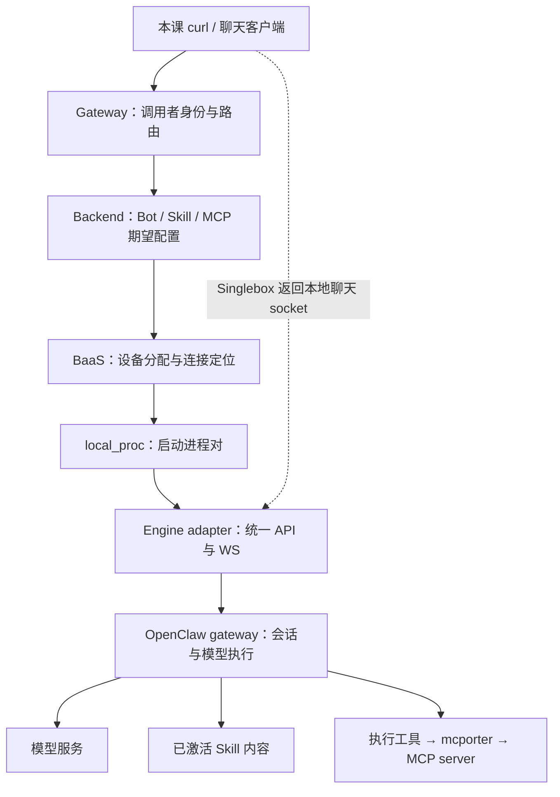

# 单 Bot 实验课：创建 → 运行环境 → Skill/MCP → 对话 → 源码

适用：Linux/macOS 本地开发；源码基线 `b17ccd42`，核对日期 2026-09-17。

这份指南围绕你亲手创建的一个 `lab-assistant` 展开。每一课按“先预测 → 操作 → 留证据 → 读源码 → 改一个变量再试”学习。建议分三次完成：创建与运行环境、能力配置、对话与故障定位；首次下载和构建时间另计。

**验证范围：**本文的路由、字段、关键调用和已知限制已静态核对；配套 Python 示例做语法检查，具体结果见文末。本次没有在 Linux/macOS 启动整个产品栈，文中的运行结果是你的验收目标，不是声称已经全部实测通过。

## 0. 先明确本次实验的边界

当前版本有四个直接影响操作的事实：

1. 默认 `src/frontend` 是 BCN 开源页面切片，主要是首页、入网、群聊。没有完整的 Bot/Skill/MCP 管理菜单。本课用产品 API 创建和配置，用一个小型客户端完成单 Bot 对话；不会让你寻找不存在的按钮。
2. Singlebox 默认 BaaS 采用 `local_proc`，一个运行实例主要对应 **Engine adapter + OpenClaw gateway 进程对**。有 Bot 不意味着有 Docker 容器。最后单独做 Docker 辨认实验。
3. Gateway **不在默认 `all` 启动组中**，本课额外启动它。内部 `/api/bots` 与公开 `/openapi/v1/bots` 的鉴权及封套不同。
4. 默认本地 MCP 市场可能为空，且 `SingleboxDeviceSyncService.sync_all_mcp_servers()` 明确跳过全量白名单同步。不能只看 MCP 激活响应就宣布已可调用。本课分别实验平台期望配置和实际 MCP 调用；后一项使用显式配置文件，让本地实验能独立复现。

本课不涉及服务 Bot 发布、团队空间审批、线上镜像交付或多 Bot 协作。Skill 采用 **Bot-local 上传 + 直接激活**，先学会最短链路，再理解 SkillSet 和受管理版本。

### 0.1 你最终应该拿出的证据

| 里程碑 | 可检查的证据 |
| --- | --- |
| Bot 创建 | `bot_id`、owner、engine、`is_ready=true` |
| 找到运行实例 | provider、device、两个端口、进程 PID、workspace |
| Skill 进入 Bot | `skill_id`、激活响应、运行时单 Skill 入口、输出标记 |
| MCP 真调用 | 输入 nonce、工具生成的随机 receipt、`calls.jsonl` 中同一条记录 |
| 对话往返 | session、WS 请求 ID、接收确认、流式事件和终态 |
| 故障恢复 | 人为失败、准确定位层次、恢复后的新 receipt |

### 0.2 先看一张图



图中 Backend 负责创建和取连接信息；每个流式 token 不必重新经过 Backend 的 Bot 创建服务。Singlebox 通常返回直连本地 adapter 的 socket，其他部署可能通过 Gateway/代理转发，以 connection 返回值为准。BCS 负责入网与协作，本课的 owner 单聊不要求先创建协作群。

## 1. 实验一：准备环境并创建一个自己的 Bot

### 1.1 进入仓库，选 Bash

macOS 默认终端可能是 zsh，先执行 `bash`。下面的命令在同一个 Bash、仓库根目录执行；新开终端时需恢复变量和函数。

```bash
pwd
git rev-parse --short HEAD
bash scripts/singlebox.sh check
```

依赖见 [依赖说明](dependencies.zh-CN.md)：Python/uv、Node.js 22+、Rust/Cargo/protoc、OpenClaw、jq、curl。缺工具时按预检输出处理；需要仓库安装向导时用 `bash scripts/singlebox.sh install-tools`，然后重跑预检。

创建独立的实验文件目录，不改用户已有配置：

```bash
export REPO_ROOT="$PWD"
export LAB_DIR="$(mktemp -d "${TMPDIR:-/tmp}/avernet-bot-lab.XXXXXX")"
chmod 700 "$LAB_DIR"
printf '实验目录：%s\n' "$LAB_DIR"
cp docs/examples/single-bot-lab/{chat_client.py,mcp_server.py} "$LAB_DIR/"
uv venv --python 3.12 "$LAB_DIR/.venv"
uv pip install --python "$LAB_DIR/.venv/bin/python" 'mcp>=1.12.4,<2' 'websockets>=14,<16'
uv pip freeze --python "$LAB_DIR/.venv/bin/python" > "$LAB_DIR/requirements-resolved.txt"
```

MCP 示例使用 [官方 Python SDK v1 的 FastMCP 接口](https://github.com/modelcontextprotocol/python-sdk/tree/v1.12.4)，所以限制在 v1 大版本；解析出的具体依赖保存在实验目录，不修改仓库依赖。

### 1.2 选模型模式，再启动

```bash
test -f .env.local || cp .env.example .env.local
```

编辑 `.env.local`，修改已有同名项，避免重复定义。**完整 Skill/MCP 对话实验需要能执行工具调用的真实模型**：

```dotenv
SINGLEBOX_MODEL_CONFIG_MODE=manual
OPENCLAW_OPENAI_BASE_URL=<你可用的模型 API base URL>
OPENCLAW_OPENAI_API_KEY=<你自己的 key>
OPENCLAW_OPENAI_MODEL_ID=<支持工具调用的模型 ID>
```

尖括号是待替换值，不原样粘贴。若已有可用 OpenClaw 模型配置，可按 [模型配置脚本](../scripts/modules/model_config.sh) 的 `home` 模式导入。

没有模型账号也能先做前半课：设 `SINGLEBOX_MODEL_CONFIG_MODE=mock`。Mock 的固定回复只能证明消息往返，不能证明读取了 Skill、作出推理或调用了 MCP。后续切换真实模型应在新建实验 Bot 之前完成。

```bash
bash scripts/singlebox.sh
bash scripts/singlebox.sh start gateway
bash scripts/singlebox.sh status
bash scripts/singlebox.sh status gateway
```

默认 all 会额外拉起五个演示 Bot 和一个 developer Bot；只对自己的实验 Bot 进行后续操作即可。

**这一版本不要用重启整个 Backend 来刷新实验配置：**[backend.sh](../scripts/modules/backend.sh) 的本地启动分支会删除现有 `backend.db` 后再启动。先保存实验记录；需要验证 Bot 重启时，只重启该 Bot。

设置本课连接变量。自定义过端口时同步修改；当前默认 Backend/BaaS 地址与 Gateway upstream 配置需保持一致。

```bash
export BACKEND_URL=http://127.0.0.1:8888
export GATEWAY_URL=http://127.0.0.1:8889
export LAB_USER=mock-user
export LAB_BOT_NAME="lab-assistant-$(date +%Y%m%d-%H%M%S)"

# 内部 API：本地身份头，只适用于本地 Singlebox。
bapi() { curl --noproxy '*' -fsS -H "x-user-id: $LAB_USER" "$@"; }
# 公开 API：发到 Gateway，由它签发并转发调用者身份。
api() { curl --noproxy '*' -fsS -H "x-dev-user: $LAB_USER" "$@"; }

curl --noproxy '*' -fsS "$GATEWAY_URL/health"
api "$GATEWAY_URL/openapi/v1/bots" | jq .
```

`x-dev-user` 依赖本地启动脚本的 `GATEWAY_AUTH_MOCK=1`；不适用于线上。公开 API 401 时先查 Gateway 和 Backend 签名配置，不能改成直接给 Backend 塞 `x-user-id` 来冒充公开接口鉴权。

### 1.3 创建：先预测“返回成功后进程是否立即就绪”

这里用仓库 demo 与 live acceptance 已采用的内部创建入口，然后用公开能力接口继续配置同一 Bot。

```bash
jq -n --arg name "$LAB_BOT_NAME" --arg user "$LAB_USER" '{
  bot_name:$name, bot_desc:"single bot learning lab",
  entity_id:$user, entity_type:"staff",
  engine_type:"openclaw", bot_type:"personal"
}' > "$LAB_DIR/create.json"

bapi -X POST "$BACKEND_URL/api/bots" \
  -H 'Content-Type: application/json' \
  --data-binary "@$LAB_DIR/create.json" > "$LAB_DIR/create-response.json"
jq '{success,error_code,message,bot:.data.bot}' "$LAB_DIR/create-response.json"
export BOT_ID="$(jq -er 'select(.success == true) | .data.bot.bot_id' "$LAB_DIR/create-response.json")"
test -n "$BOT_ID"
```

若提取 ID 失败就停在这里：检查业务响应，不继续执行后续命令。需要授权的环境会返回待授权信息，按 [创建接口指南](bot-create-api-guide.zh-CN.md) 完成授权并原样回传创建参数；Singlebox 的本地实现与真实 Passport 环境不同。

轮询最多约三分钟，每次请求另有超时：

```bash
wait_ready() {
  local i
  for i in $(seq 1 90); do
    bapi --max-time 10 "$BACKEND_URL/api/bots/$BOT_ID/status?owner_id=$LAB_USER" \
      > "$LAB_DIR/status.json" || return 1
    jq '{success,data}' "$LAB_DIR/status.json"
    jq -e '.success == true and .data.is_ready == true' "$LAB_DIR/status.json" >/dev/null && return 0
    jq -e '.data.bot_status == "FAILED"' "$LAB_DIR/status.json" >/dev/null && return 1
    sleep 2
  done
  return 1
}
wait_ready
api "$GATEWAY_URL/openapi/v1/bots/$BOT_ID" > "$LAB_DIR/bot.json"
jq '.data' "$LAB_DIR/bot.json"
```

**验收：**创建成功、就绪状态、公开详情中的 Bot 是同一个。不要仅凭 HTTP 200 判断成功：内部接口还要看 `success`；公开接口要看 `code/data`。

**现在读源码，只追一条调用：**

1. [内部创建 Router](../src/backend/src/agentclaw/community/adapters/http/bot_management/router.py)：搜索 `create_bot`，看请求如何变为创建参数。
2. [create_flow.py](../src/backend/src/agentclaw/community/core/bot_management/create_flow.py)：`create_bot_with_authorization`，找授权与创建的分界。
3. [BotService](../src/backend/src/agentclaw/community/core/bot_management/services/bot_service.py)：`create_bot`，找记录写入、设备分配及后续初始化。
4. [BaaS BotManagementService](../src/baas/src/secbaas/community/core/service/bot_manage/_bot_management_service.py)：`create_bot`，继续追选中的 sandbox provider。

回答：Bot 记录的 ID、设备 ID、实际运行进程分别在哪一步产生？这三个概念为什么不能互换？

## 2. 实验二：把 Bot 对应到进程、目录与“容器”

先预测：`docker ps` 能否找到这个 Bot？然后从日志获取实际信息：

```bash
rg -n --fixed-strings "$BOT_ID" scripts/.dependencies/logs test-bots \
  -g '*.log' -g '*.json' | head -n 70
```

日志可能包含本地凭据，不把整份日志粘贴到公共 issue。定位并记录：

```text
BOT_ID         =
owner_id       =
device_id      =
device_provider=
sandbox 实现   = local_proc（用配置和日志证实）
adapter_port   =
openclaw_port  =
workspace      =
config_dir     =
```

默认 runtime 目录位于 `test-bots/aidesktop/` 之下，但不要按 Bot 名猜路径。`_workspace.py` 的 metadata、环境变量、配置优先级会改变实际位置。

填入**刚刚观察到的绝对路径和端口**：

```bash
export WORKSPACE='<实际 workspace 绝对路径>'
export CONFIG_DIR='<实际 config_dir 绝对路径>'
export ADAPTER_PORT='<实际 adapter_port>'
export OPENCLAW_PORT='<实际 openclaw_port>'
export ENGINE_URL="http://127.0.0.1:$ADAPTER_PORT"

curl --noproxy '*' -fsS "$ENGINE_URL/health" | jq .
lsof -nP -iTCP:"$ADAPTER_PORT" -sTCP:LISTEN
lsof -nP -iTCP:"$OPENCLAW_PORT" -sTCP:LISTEN
ls -ld "$WORKSPACE" "$CONFIG_DIR"
tail -n 40 "$CONFIG_DIR/gateway.log"
```

Linux 没有 `lsof` 时可用 `ss -ltnp`。根据 PID 查看 `ps -p <PID> -o pid,ppid,command`，观察它们是不是本机进程。

**验收：**Engine `/health` 报 `engine=openclaw`；两个监听端口属于这一个 Bot 的进程对，而不是默认 CEO Bot 或其他实例。

**源码解释：**

| 文件 | 你要找的因果关系 |
| --- | --- |
| [BaaS Singlebox 配置](../src/baas/singlebox-configs/application-dev.yaml) | `sandbox.arca: local_proc`，理解逻辑 provider 名与实现名的区别 |
| [本地 sandbox plugin](../src/baas/src/secbaas/community/plugins/sandbox/arca/local_proc/_sandbox_plugin.py) | 分配两个端口、生成配置、启动进程 |
| [process manager](../src/baas/src/secbaas/community/plugins/sandbox/arca/local_proc/_process_manager.py) | `create_openclaw_config`、`_spawn_openclaw`、adapter 启动与健康检查 |
| [workspace resolver](../src/baas/src/secbaas/community/plugins/sandbox/arca/local_proc/_workspace.py) | 谁拥有 workspace 的物理路径，为什么不能在 Backend 随意硬编码 |

概念对照：**Bot 是业务身份；device/sandbox 是执行承载；engine 是运行实现；session 是某次会话上下文。** Docker container 只是执行承载的一种实现。本地 `local_proc` 不提供容器级文件系统隔离。

## 3. 实验三：先发送一条普通消息，建立基线

先拿 session，再拿短期连接信息：

```bash
new_session() {
  api -X POST "$GATEWAY_URL/openapi/v1/bots/$BOT_ID/sessions" \
    -H 'Content-Type: application/json' -d '{"title":"single-bot-lab"}' \
    > "$LAB_DIR/session.json" || return 1
  export SESSION_ID="$(jq -er '.data.session_id' "$LAB_DIR/session.json")" || return 1
}
chat() {
  api "$GATEWAY_URL/openapi/v1/bots/$BOT_ID/connection" \
    > "$LAB_DIR/connection.json" || return 1
  chmod 600 "$LAB_DIR/connection.json"
  "$LAB_DIR/.venv/bin/python" "$LAB_DIR/chat_client.py" \
    --connection "$LAB_DIR/connection.json" --session "$SESSION_ID" \
    --user "$LAB_USER" --message "$1"
}
new_session
chat '你好。请用一句话介绍你能如何帮助我。' | tee "$LAB_DIR/chat-baseline.log"
```

公开连接信息可能带短期 token，只保存到本地实验目录。客户端使用返回的 socket URL，不手工拼接签名或生产代理 URL。

**观察三个不同的结果：**

1. `connect: ok`：适配器握手完成。
2. `chat.send` 对应 `res/ok=true`：消息被接收，不意味着模型已回答。
3. `chat` 事件最终出现 `state=final`：这一轮执行完成；`error/aborted` 是另外的终态。

Mock 模式可能只有固定问候。真实模式如果只握手成功、随后模型报错，先查模型配置，不重复创建 Bot。

**源码阅读：**

- [connection Router](../src/backend/src/agentclaw/community/adapters/http/openapi_v1/engine_runtime/connection/router.py)：如何由 Bot 得到可用 socket。
- [sessions Router](../src/backend/src/agentclaw/community/adapters/http/openapi_v1/engine_runtime/sessions/router.py)：如何转到设备上的 `/api/sessions`。
- [Engine WS server](../src/engine/src/engine/community/api/transport/ws_server.py)：`_handle_handshake` → `_handle_chat_send` → 后台流式任务。
- [OpenClaw chat adapter](../src/engine/src/engine/community/core/adapters/openclaw/chat.py) 与 [native chat port](../src/engine/src/engine/community/plugins/openclaw/_chat.py)：统一消息如何进入原生引擎。

入站 adapter 协议在 [frames.py](../src/engine/src/engine/community/kernel/frames.py) 是 v3；不要把 OpenClaw 原生 gateway 的另一套握手版本直接套到本课客户端。

若 session/connection 报 502，先检查同一 Bot 的 adapter health 和 BaaS 日志。仓库的 [expert chat acceptance](../src/backend/tests/community/acceptance/expert_chat/test_chat_session_lifecycle.py) 还记录了 local_proc invoke-http 路径的条件性 xfail；它是排查线索，不能直接认定所有聊天链路都可用，也不能用 mock 服务通过代替真实链路通过。

## 4. 实验四：上传、激活、停用一个可辨认的 Skill

先想清楚：Skill 是一份可被引擎发现并采用的说明/资源包，不是一个自动运行的后台服务。

### 4.1 制作实验包

```bash
mkdir -p "$LAB_DIR/lab-report"
cat > "$LAB_DIR/lab-report/SKILL.md" <<'EOF'
---
name: lab-report
description: 用户要求“链路实验报告”时使用；以固定栏目整理实验事实和验证证据。
---

# 链路实验报告

当用户要求链路实验报告时，先输出 LAB-SKILL-V1。
按下面三个栏目回答：
1. 观察事实
2. 可验证证据
3. 尚未确认

缺少证据时明确说明，不要编造工具调用、路径或执行结果。
EOF

"$LAB_DIR/.venv/bin/python" - "$LAB_DIR" <<'PY'
from pathlib import Path
from zipfile import ZipFile
import sys
root = Path(sys.argv[1])
with ZipFile(root / 'lab-report.zip', 'w') as archive:
    archive.write(root / 'lab-report/SKILL.md', 'lab-report/SKILL.md')
PY
```

### 4.2 上传后先别激活

```bash
api -X POST "$GATEWAY_URL/openapi/v1/bots/$BOT_ID/skills" \
  -H 'Content-Type: application/zip' --data-binary "@$LAB_DIR/lab-report.zip" \
  > "$LAB_DIR/upload.json"
jq . "$LAB_DIR/upload.json"
export SKILL_ID="$(jq -er '.data.skill.skill_id' "$LAB_DIR/upload.json")"
api "$GATEWAY_URL/openapi/v1/bots/$BOT_ID/skills?source=LOCAL" | jq .
```

注意是 POST 到 `.../skills`，不是猜测出的 `/skills/upload`；请求体为 **ZIP 原始字节**，不是 multipart。

首次上传预期 HTTP 201，`operation=created`、`active=false`。这时只证明资产已经上传，尚未选择给 Bot 使用。

```bash
new_session
chat '请做一份链路实验报告：我刚创建了一个 Bot，还没有验证它的工具。'
```

记录基线输出，不在问题中泄露 `LAB-SKILL-V1`。若未激活也出现标记，应检查已有上下文、默认能力、运行时目录和扫描范围，而不是跳过异常。

### 4.3 激活并检查三层状态

```bash
api -X POST "$GATEWAY_URL/openapi/v1/bots/$BOT_ID/skills/$SKILL_ID/activate" \
  > "$LAB_DIR/activate.json"
jq '.data | {skill,changed,desired_state,runtime_projection}' "$LAB_DIR/activate.json"

# 重复一次，观察幂等性；正常情况下 changed=false，但仍可再次协调运行时。
api -X POST "$GATEWAY_URL/openapi/v1/bots/$BOT_ID/skills/$SKILL_ID/activate" | jq .
new_session
chat '请做一份链路实验报告：我刚创建了一个 Bot，还没有验证它的工具。'
```

分别记录：

| 层次 | 看什么 | 解释 |
| --- | --- | --- |
| 期望状态 | `skill.active`、`desired_state.status` | DB 已选择安装/激活 |
| 运行时投影 | `runtime_projection.status/issues` | 是否已交付并收敛 |
| 实际执行 | 新会话标记、栏目、可用的读取/工具事件 | 是否真的影响本轮回答 |

`COMMITTED` 与 `CONVERGED` 是两回事。`PENDING/DEGRADED/SKIPPED` 需要读问题项；特别是本地 noop，甚至还需要文件和执行证据核实。

观察实际 workspace 下的技能相关目录，**只读**：

```bash
find "$WORKSPACE" -maxdepth 5 -name SKILL.md -print
find "$WORKSPACE" -maxdepth 5 -type l -print -exec readlink {} \;
```

路径不在 workspace 下时，沿实际 runtime layout、日志和 [布局规划器](../src/engine/src/engine/community/core/skills/layout_planner.py) 找 active root。不要为了“让它能找到”而把整个 `skills-local` 或 `skills-repo` 链到 active。

**对照实验：**

```bash
api -X POST "$GATEWAY_URL/openapi/v1/bots/$BOT_ID/skills/$SKILL_ID/deactivate" | jq .
new_session
chat '请做一份链路实验报告：我刚创建了一个 Bot，还没有验证它的工具。'
api -X POST "$GATEWAY_URL/openapi/v1/bots/$BOT_ID/skills/$SKILL_ID/activate" | jq .
```

每次开新会话，减少旧上下文影响。模型输出不是严格单测：一次没标记可能是选择未触发；优先用 active 入口、内容、运行时状态定位，再明确要求使用 `lab-report` 验证。

### 4.4 带着结果进入源码

```text
skills Router
  → LocalSkillUploadService（解析包、写内容与资产）
  → DirectActivationService（激活/停用命令）
  → Desired State 事务 / Installation
  → 有效能力读取与解析
  → BotRuntimeProjector
  → SkillRuntimeDelivery / DeviceSync
  → Engine 布局与单 Skill 入口
  → 新会话发现 / 使用 Skill
```

从 [Skill 模块 AGENTS.md](../src/backend/src/agentclaw/community/core/skill_center/AGENTS.md) 第 2、3、7 节进入，再读 [公开 Router](../src/backend/src/agentclaw/community/adapters/http/openapi_v1/skills/router.py)、[DirectActivationService](../src/backend/src/agentclaw/community/core/skill_center/services/direct_activation_service.py)、[BotRuntimeProjector](../src/backend/src/agentclaw/community/core/skill_center/services/bot_runtime_projector.py)、[交付边界](../src/backend/src/agentclaw/community/core/skill_center/services/runtime_projections/skill_runtime_delivery.py)。

思考：停用后资产文件为何可以仍存在？答案应该涉及“内容库”和“有效能力/发现入口”的区别。

## 5. 实验五：MCP 管理配置与真实工具调用

### 5.1 先做平台管理实验，亲眼观察本地限制

MCP 需要区分三份事实：服务定义（怎么连接）、用户配置（凭据/headers）、Bot 安装关系（哪个 Bot 使用）。

```bash
api "$GATEWAY_URL/openapi/v1/bots/mcp/servers" | jq .
api "$GATEWAY_URL/openapi/v1/bots/$BOT_ID/mcps" | jq .
api -X POST "$GATEWAY_URL/openapi/v1/bots/$BOT_ID/mcps/lab-probe/activate" \
  > "$LAB_DIR/mcp-activate.json"
jq . "$LAB_DIR/mcp-activate.json"
api "$GATEWAY_URL/openapi/v1/bots/$BOT_ID/mcps" | jq .
curl --noproxy '*' -fsS "$ENGINE_URL/api/mcp" | jq .
```

未知服务可能被权限/定义检查拒绝，或保存了安装关系但无法下发；记录实际结果即可。**这里没有给平台一个 MCP 地址，不能期待一个 `server_code` 自动变出服务。** 后面的实际调用实验不依赖这一激活命令成功。

如果平台清单显示 active，而 Engine 清单没有服务，沿下面顺序解释：

- [MCP Router](../src/backend/src/agentclaw/community/adapters/http/openapi_v1/mcp/router.py)：Bot 的 `/mcps/{code}/activate` 与账号级 `/mcp/servers/{code}/config` 是不同资源。
- [本地 MCP Center](../src/backend/src/agentclaw/community/plugins/local/mcp_center.py)：默认查询为空。
- [Singlebox DeviceSync](../src/backend/src/agentclaw/community/core/devices/services/singlebox_device_sync.py)：全量白名单同步显式跳过并返回 True。
- [Engine MCP port](../src/engine/src/engine/community/plugins/openclaw/_mcp.py)：写配置、执行 `mcporter call`、执行 `filter-servers` 是不同操作；状态 `running` 在此可能仅由配置 `enabled` 推导。

账号级 `PUT .../mcp/servers/{code}/config` 用于 api_key、endpoint_env、transport_protocol、headers，**不是任意新 MCP URL 的注册入口**。不要给它加不存在的 `url` 或 `command` 字段。配置变更可能推到该用户多个设备，本课不修改已有共享服务凭据。

### 5.2 做一个可验证的本地 MCP

配套的 [mcp_server.py](examples/single-bot-lab/mcp_server.py) 暴露 `lab_probe(nonce)`。它给每次调用生成随机 receipt，并写入同目录 `calls.jsonl`。模型不知道事先的 receipt，因此可以用文件记录交叉验证。

安装实验目录私有的 mcporter CLI：

```bash
npm install --prefix "$LAB_DIR/mcporter-cli" mcporter
export MCPORTER="$LAB_DIR/mcporter-cli/node_modules/.bin/mcporter"
"$MCPORTER" --version
"$MCPORTER" --help
```

保留生成的 `package-lock.json` 以便复现实验版本。本课使用公共 CLI 的 `--config/list/call`；仓库要求的 `filter-servers` **不能假定公共包一定提供**。显式配置文件与 stdio 服务定义见 [mcporter 配置说明](https://github.com/steipete/mcporter/blob/main/docs/config.md)。

生成仅供本实验使用的客户端配置：

```bash
"$LAB_DIR/.venv/bin/python" - "$LAB_DIR" <<'PY'
from pathlib import Path
import json, sys
p = Path(sys.argv[1])
config = {'mcpServers': {'lab-probe': {
    'description': 'Return a fresh experiment receipt',
    'command': str(p / '.venv/bin/python'),
    'args': [str(p / 'mcp_server.py')]
}}}
(p / 'mcporter.json').write_text(json.dumps(config, indent=2), encoding='utf-8')
PY

"$MCPORTER" --config "$LAB_DIR/mcporter.json" list lab-probe
"$MCPORTER" --config "$LAB_DIR/mcporter.json" call lab-probe.lab_probe nonce=terminal-baseline
tail -n 1 "$LAB_DIR/calls.jsonl"
```

**验收：**CLI 的 nonce/receipt 与服务器记录完全一致。此时只证明“终端 → MCP”可用，还没证明 Bot 调用。

stdio MCP 由客户端拉起子进程，以标准输入输出通信；不需要 curl 一个端口。HTTP MCP 才需要考虑监听地址、网络与容器可达性。

### 5.3 让同一个 Bot 通过 Skill 使用 MCP

为使本地实验不依赖 Singlebox 尚未完成的市场/白名单投影，在 `lab-report` Skill 中明确指定实验客户端与配置。这验证的是 **Bot → 执行工具 → MCP 协议 → server**，不是平台托管 MCP 自动激活已打通。

```bash
"$LAB_DIR/.venv/bin/python" - "$LAB_DIR" "$MCPORTER" <<'PY'
from pathlib import Path
from zipfile import ZipFile
import shlex, sys
p, cli = Path(sys.argv[1]), sys.argv[2]
skill = p / 'lab-report/SKILL.md'
extra = f'''

## MCP 取证实验

用户要求“MCP 取证”时，使用运行环境提供的执行工具运行下面的命令，
把 `<NONCE>` 替换为用户提供的、仅含英文字母数字和短横线的 nonce：

    {shlex.quote(cli)} --config {shlex.quote(str(p / 'mcporter.json'))} call lab-probe.lab_probe nonce=<NONCE>

不要直接运行 mcp_server.py 来伪造一次工具调用；通过 mcporter 进行 MCP 调用。
返回 LAB-SKILL-V1，并按三个栏目列出工具返回的 nonce、receipt 和 utc。
执行失败或需要批准时如实说明；不要编造 receipt，也不要自行修改配置绕过失败。
'''
skill.write_text(skill.read_text(encoding='utf-8') + extra, encoding='utf-8')
with ZipFile(p / 'lab-report.zip', 'w') as z:
    z.write(skill, 'lab-report/SKILL.md')
PY

api -X POST "$GATEWAY_URL/openapi/v1/bots/$BOT_ID/skills" \
  -H 'Content-Type: application/zip' --data-binary "@$LAB_DIR/lab-report.zip" \
  > "$LAB_DIR/replace.json"
jq '.data' "$LAB_DIR/replace.json"
```

同名上传预期 `operation=updated`，保留 skill_id 和激活状态。只做一次上述追加；想重新实验时从 4.1 重新生成原始 Skill 再追加。

```bash
new_session
chat '请使用 lab-report 做 MCP 取证，nonce=bot-proof-01，并给出链路实验报告。' \
  | tee "$LAB_DIR/chat-mcp.log"
tail -n 3 "$LAB_DIR/calls.jsonl"
```

**严格验收：**新产生的服务器记录含 `nonce=bot-proof-01`；Bot 最终展示的随机 receipt 与该记录相同；WS/引擎日志能观察到执行工具活动。仅说“我已经调用了 MCP”不算通过。

这里的绝对路径在同一台机器的 local_proc 中通常可访问；若运行在容器或启用了额外沙箱限制，必须通过该环境正式的挂载/工具权限配置使路径可达。工具审批出现时按部署的正常流程处理，不关闭全局保护。配套客户端会打印审批事件，但不自动批准；需要在支持该审批的产品界面/原生引擎工具中完成审批后继续。如果 MCP 终端基线成功而 Bot 不能执行，定位工具权限、Skill 加载和运行环境路径。

### 5.4 进一步观察 Engine 的 MCP 适配边界

对照 [Engine MCP Router](../src/engine/src/engine/community/api/mcp/router.py) 的 `POST /api/mcp` 与 `POST /api/mcp/call-tool`：前者写服务配置，后者执行工具。

暂不直接给默认 Engine 写实验服务：当前 adapter 的默认配置是 `~/.mcporter/mcporter.json`，见 [config.py](../src/engine/src/engine/community/config.py) 的 `load_mcporter_config_path`；本机多个 Bot 进程可能共享同一个 HOME。写入该文件不等于只配置这一个 Bot。

另一个值得亲自查的点：Engine 读写支持 `ENGINE_MCPORTER_CONFIG_PATH`，但 `_mcp.py::call_tool` 调 CLI 时没有显式 `--config`。因此读配置路径与 CLI 实际查找路径必须核对。不要通过“GET 清单里有”推断调用一定读到同一份配置。

**你现在应能说清：**终端客户端配置、平台用户配置、Bot 安装关系、Engine 实际配置、模型是否调用，是五个不同的观察点。

## 6. 实验六：用失败检验你是否理解链路

一次只改一个变量，使用新会话，保存本次响应。

| 实验 | 操作 | 应该检查什么 |
| --- | --- | --- |
| Skill 停用 | 用 4.3 的 deactivate，再开新会话 | 资产仍在；直接安装被撤销；发现入口与输出是否变化 |
| MCP 服务失败 | `touch "$LAB_DIR/fail.flag"`，再让 Bot 取证 `nonce=bot-fail-01` | 工具失败信息；不应出现这个 nonce 的成功 receipt；Bot 不应编造 |
| MCP 恢复 | `rm "$LAB_DIR/fail.flag"`，再取证 `nonce=bot-recovered-01` | 同一配置恢复；生成新的成功记录 |
| 期望态重复写 | 对已激活 Skill 再 activate | `changed=false`；并非无需检查运行时 |
| MCP 管理停用 | 调下面 deactivate，再检查 Engine/终端显式配置 | 平台安装关系与实验旁路配置生命周期不同 |

```bash
api -X POST "$GATEWAY_URL/openapi/v1/bots/$BOT_ID/mcps/lab-probe/deactivate" | jq .
api "$GATEWAY_URL/openapi/v1/bots/$BOT_ID/mcps" | jq .
```

实验旁路的 `mcporter.json` 不由平台管理，因此平台停用不会删除它。这不证明平台权限可被正确执行，而是证明你使用了不同的控制边界。要验收正式托管 MCP，必须补齐目录、下发、白名单、实例隔离，再从 Bot 执行侧验证停用结果。

### 6.1 可选：只重启这个实验 Bot

先保存 Bot ID、设备 ID、端口、Skill 状态，阅读 [restart Router](../src/backend/src/agentclaw/community/adapters/http/bot_management/router.py) 的 `restart_bot`：它可能释放旧设备再分配新设备。

```bash
bapi -X POST "$BACKEND_URL/api/bots/$BOT_ID/restart?owner_id=$LAB_USER" | jq .
wait_ready
```

重做实验二，重新获取端口与连接信息，创建新会话再验证 Skill/MCP。不要继续用旧 adapter 端口。记录哪些身份稳定、哪些运行信息改变；如果文件或期望状态未恢复，定位初始化/投影链路，不把失败写成“重启必然保留一切”。

## 7. 实验七：真正理解 Docker 容器

这一课与前面的 local_proc 形成对照。仓库 [Docker 指南](docker.zh-CN.md) 的 `Dockerfile.ocb` 主要打包 BCS、前端和五个 OpenClaw 演示实例；不能等同于完整 Backend/Skill 管理栈，更不是“一 Bot 一容器”的证据。

若要实际运行，先停止本课栈，避免端口冲突，并保存证据：

```bash
bash scripts/singlebox.sh stop gateway
bash scripts/singlebox.sh stop
docker build -f Dockerfile.ocb -t avernet-lab:local .
docker run -d --name avernet-container-lab \
  -p 127.0.0.1:8000:8000 -p 127.0.0.1:21000:21000 avernet-lab:local
docker ps --filter name=avernet-container-lab
docker top avernet-container-lab
docker inspect --format '{{json .Mounts}}' avernet-container-lab
docker inspect --format '{{json .NetworkSettings.Ports}}' avernet-container-lab
docker logs --tail 80 avernet-container-lab
```

这一步不传模型 key，先验证容器与进程结构；网络/构建失败按 Docker 指南定位，不将构建视为已通过。

回答四个问题：

1. 一个容器内能不能有多个 Bot 进程？用 `docker top` 找证据。
2. 镜像、容器、进程、挂载目录分别是什么？哪个保存可复用程序，哪个保存这一运行实例状态？
3. 容器内 `127.0.0.1` 指向谁？为什么宿主机上的 MCP/模型端口不能总用同一个地址访问？
4. 没挂 volume 的容器被删除后，实验状态还能否指望保留？

只清理本课的容器：

```bash
docker stop avernet-container-lab
docker rm avernet-container-lab
```

不执行 `docker system prune` 或清理整个仓库 runtime。以后再次启动 Singlebox 前牢记 Backend 启动的数据库重置行为。

## 8. 把源码串成你能复述的三条链

### 创建链

```text
curl /api/bots
→ Backend Router / create_flow
→ BotService（业务记录、创建策略）
→ Device/BaaS 边界
→ BaaS BotManagementService / sandbox provider
→ local_proc（workspace、配置、端口、进程）
→ Engine adapter 与 OpenClaw gateway 就绪
→ /status 观测 is_ready
```

### 配置链

```text
Skill 包上传 → Bot-local 内容与资产
激活命令 → 持久 Desired State → 有效能力集合
→ Resolver / RuntimeProjector → 设备交付 → 引擎单 Skill 入口

托管 MCP：目录定义 + 用户配置 + Bot 安装关系
→ MCP 投影 / 设备同步 → 引擎配置 / whitelist → 工具执行
  （本地默认目录与全量白名单存在上述限制）
```

SkillSet 是组织方式：有效 Skill 由直接安装与已启用 Set 成员取并集、按身份去重。移除一个来源未必让 Skill 失效。Bot-local 上传不等同于 Space Skill 发布；后者有草稿、不可变版本、Track Latest 等额外边界。继续学习见 [领域词汇表](../CONTEXT.md) 和 [Skill 模块说明](../src/backend/src/agentclaw/community/core/skill_center/AGENTS.md)。

### 对话与工具链

```text
创建 session / 获取 connection
→ 客户端 connect → chat.send
→ Engine WS adapter → OpenClaw chat port → 模型
→ Skill 提供步骤 → 执行工具 → mcporter → MCP server
→ 工具结果回到模型 → 流式回复 / final → 客户端
```

用本次真实的 Bot ID、session、请求 ID、nonce 和 receipt，在这三条链旁标注实际证据。跨模块不保证共享同一 trace ID：无法直接关联时使用身份、请求时间和运行实例共同定位，不虚构一条全链路 trace。

## 9. 从实验进入测试，不靠背文件名

先打开测试读断言，再预测其中一个失败场景。需要运行时，使用该模块的现有环境和 pytest 配置：

```bash
cd "$REPO_ROOT/src/backend"
uv run pytest \
  tests/community/core/skill_center/test_direct_activation_service.py \
  tests/community/core/skill_center/test_local_skill_upload_service.py \
  tests/community/core/devices/test_singlebox_device_sync.py
cd "$REPO_ROOT/src/engine"
uv run pytest src/engine/community/plugins/openclaw/tests/test_mcp_port.py
cd "$REPO_ROOT"
```

这些是定向单测，不要求本课先跑全套 CI，也不能替代真实对话验收。若依赖或测试初始化失败，按模块 README 处理并记录“未运行”，不要当作产品行为失败。更多测试入口：

- [创建与真实实例 fixture](../src/backend/tests/community/acceptance/_fixtures/live_personal_bot.py)：创建成功后为什么还要轮询。
- [BotRuntimeProjector 合同测试](../src/backend/tests/community/contracts/test_bot_runtime_projector.py)：期望态与运行时边界。
- [OpenClaw layout activation 测试](../src/engine/src/engine/community/plugins/openclaw/tests/test_layout_activation.py)：入口、软链与已有用户内容。
- [OpenClaw chat streaming 测试](../src/engine/src/engine/community/plugins/openclaw/tests/test_chat_stream.py)：请求接收和流式终态。

## 10. 完成记录与排错表

复制以下表格到实验笔记，填“事实与证据”，不要只填勾号。

| 项目 | 本次记录 |
| --- | --- |
| commit / OS / 模型模式 | |
| bot_id / owner / engine | |
| provider / device / PID / adapter port | |
| workspace / 实际 active root | |
| skill_id / active / projection status | |
| session / WS 请求 ID / terminal state | |
| MCP nonce / receipt / 对应日志行 | |
| 故障注入与恢复 | |
| 托管 MCP 限制是否仍存在 | |
| 三条调用链中仍无法解释的一跳 | |

| 现象 | 优先排查 |
| --- | --- |
| 前端没有创建/Skills/MCP 菜单 | `src/frontend/config/routes.ts` 的开源路由范围；继续用本课 API |
| 公开 API 401 | Gateway 是否另行启动；`x-dev-user` 和 mock 开关；签名两端配置 |
| 创建成功、is_ready 不成功 | BaaS/local_proc 日志、模型/插件启动、端口、device 绑定 |
| Bot 查不到或 owner 不一致 | 内部创建与 Gateway 是否使用同一用户和租户；是否刚重启 Backend 清库 |
| Skill active=true 但没有行为变化 | projection/issues、实际入口、会话缓存、模型模式与选择行为 |
| MCP active=true 但没有工具 | 目录定义、本地 noop/跳过同步、实际 config、CLI 兼容性 |
| MCP 终端能调用、Bot 不能调用 | Skill 是否加载、工具权限、进程可见路径、Node/Python 执行环境 |
| 输出说已调用，但没有 receipt 记录 | 未通过验收；查执行事件，不能采用模型自述作证据 |
| Bot 重启后连接失效 | 重新定位设备/端口，并重新获取 connection |

正常结束时可停服务保留实验文件：

```bash
bash scripts/singlebox.sh stop gateway
bash scripts/singlebox.sh stop
```

不要提交 `.env.local`、connection token、生成日志或 runtime 数据。实验目录删除前先保留脱敏的学习笔记；删掉后，Skill 中的实验绝对路径会失效，这是预期行为。

### 本指南编制时的检查

- 已核对当前源码中的启动组、local_proc、创建/状态/Skill/MCP/session/connection 路由、adapter WS v3 协议和本地限制。
- 未启动 Linux/macOS 全栈，未执行真实模型对话、实际托管 MCP 下发或 Docker 构建。
- 两个 Python 示例通过 AST 语法检查；文档的本地文件链接逐个存在性检查通过。当前编制环境缺少示例的 mcp/websockets 依赖，未执行其端到端协议调用；请把你的运行验收补到上表。
